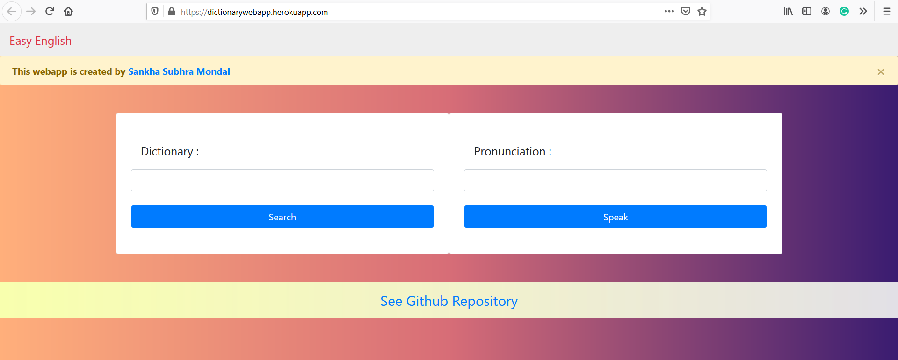

   

# dictionarywebapp

visit the site : https://dictionarywebapp.herokuapp.com/
This repository contains the files realted to dictionarywebapp which is deployed in heroku

## Easy English,
a dictionary web helps to find the meaning (English to English) of a given word provided by the user apart from that, it also helps users in pronunciation.

This web app doesn't have any database. It's build using web scraping. Let's discuss the workflow : 

when an user searched for a particular word. Let's say the word is "knife". That word "knife" is received by the function present in the python-flask (used for backend) through the POST method.
Both URL, URL1 are formatted with the word "knife". Both the URL and URL1 are passed in two functions named "def meaning()" and "def synonym() respectively. These two scraping functions (Scraping has been done using BeautifulSoup library)return meanings and synonyms which is further displayed on this page URL("https://dictionarywebapp.herokuapp.com/dictionary")

Speak functionality has been introduced using javascript.(using SpeechSynthesisUtterance() method)

Meanings have been scraped from URL = 'https://www.yourdictionary.com/'

Synonyms have been scraped from URL = 'https://thesaurus.yourdictionary.com/'

### In the main.py file : 

#### def home() --> this method displays default home page of the web app
#### def word() --> receives the word provided by the user and restructures the above two URLs.

For the word 'knife' respected URLs will be like this:
		 1. https://www.yourdictionary.com/knife
		 2. https://thesaurus.yourdictionary.com/knife

respectively

#### def meaning() --> used for scraping meanings from 'https://www.yourdictionary.com/'   
#### def synonym() --> used for scraping synonyms from 'https://thesaurus.yourdictionary.com/'

Again,for the word 'knife' respected URLs will be like this:
		 1. https://www.yourdictionary.com/knife
		 2. https://thesaurus.yourdictionary.com/knife

respectively.

#### def word() --> renders the new template "wordresult.html" from the templates folder. 

